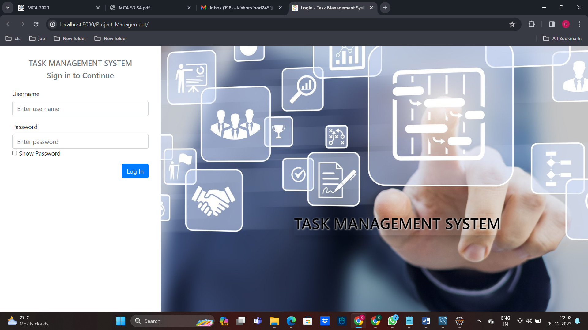

# Software Firm Task Management System
#demo

## Overview
This project is a task management system for a software firm, developed using Java, Maven, MySQL, and Eclipse with Tomcat. It helps in managing tasks, assigning them to team members, and tracking the progress of each task.

## Table of Contents
- [Prerequisites](#prerequisites)
- [Installation](#installation)
- [Configuration](#configuration)
- [Usage](#usage)
- [Project Structure](#project-structure)
- [Contributing](#contributing)
- [License](#license)

## Prerequisites
Before you begin, ensure you have the following tools installed on your system:
- [Java Development Kit (JDK)](https://www.oracle.com/java/technologies/javase-downloads.html)
- [Apache Maven](https://maven.apache.org/install.html)
- [MySQL](https://dev.mysql.com/downloads/mysql/)
- [Eclipse IDE](https://www.eclipse.org/downloads/)
- [Apache Tomcat](http://tomcat.apache.org/download-90.cgi)

## Installation

### 1. Clone the Repository
```sh
git clone https://github.com/kishorvinod/Software-Firm-Task-Management-System-.git
cd Software-Firm-Task-Management-System-

Feel free to customize this template to better match the specifics of your project. This README provides a clear overview of the project, instructions for setting up the development environment, and guidance on how to contribute.
